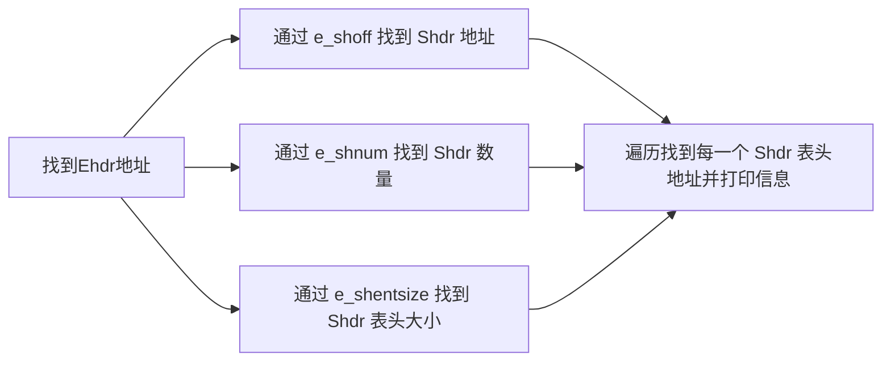

# Lab1实验报告

## 实验思考题

### Thinking 1.1

1. `objdump -DS 输出可执行文件名 > 导出文本文件名`

-D, --disassemble-all    Display assembler contents of all sections 反汇编所有section

-S, --source            Intermix source code with disassembly 将源代码与反汇编混合，尽可能反汇编出源代码

2. 课程平台的 MIPS 交叉编译器重复上述各步编译过程，如下图所示：

   - 命令行内容

     

   - hello.c 中内容

     

   - 反汇编出的内容

     

### Thinking 1.2

用`readelf -h`解析testELF与vmlinux文件，解析结果分别如下


由解析结果可看出，testELF 文件为小端存储，vmlinux 为大端存储，而我们的 readelf 文件只能对小端存储的文件进行解析，因此无法解析vmlinux。

### Thinking 1.3

一般情况下，计算机系统刚上电时是没有正常的 C 语言环境，不能读取解析 ELF 文件。所以需要从电启动地址开始，依靠 bootloader 引导操作系统内核启动。


我们的 MOS 操作系统的目标是在 GXemul 仿真器上运行，GXemul 仿真器支持直接加载 ELF 格式的内核，也就是说，GXemul 已经提供了 bootloader 全部功能。GXemul 支持加载 ELF 格式内核，所以启动流程中 stage1 不需要执行，stage2 被简化为加载内核到内存，之后跳转到内核的入口即可。能保证内核入口被正确跳转到。

### Thinking 1.4

如果 S1 和 S2 两个段在某页的中间相接，先后被加载，如果每次都获取新页，会导致这页对应虚地址关联到了两个实页。


加载段的时候，如果两边不是页对齐的，那么会先检查这个地址是否已经被映射到一个实地址，如果没有映射到实地址才申请新页，防止为一个地址申请多个页产生冲突。

### Thinking 1.5

通过命令`readelf -a gxemul/vmlinux`可知，如图所示

内核的入口 _start 的位置在 0x80010000 处，main 函数的位置在 0x80010040 处。


通过 exercise 1.4 可知，在 start.S 文件里，通过跳转指令 jal 跳转到 main 函数地址进入。

在跨文件调用函数时，每个函数会被分配一个固定的地址，调用过程为 将需要存储的值进行保护（比如入栈等方式），再用 jal 跳转到相应函数的地址。

### Thinking 1.6

```assembly
/* Disable interrupts 禁用中断 */
mtc0 zero, CP0_STATUS # 把 CPU 通用寄存器 zero 的内容传送到协处理器 0 寄存器 CP0_STATUS
......
/* disable kernel mode cache 禁用内核模式缓存 */
mfc0 t0, CP0_CONFIG # 通用寄存器 t0 装入 CPU 控制寄存器 CP0_CONFIG 的值
and t0, ~0x7 # ~0x7 给出要清零的位的反码，将 t0 相应位清零 （清零低 3 位）
ori t0, 0x2 # 0x2 给出要置 1 的位，将 t0 相应位置 1 （将第 2 位置 1）
mtc0 t0, CP0_CONFIG # 把 CPU 通用寄存器 t0 的内容传送到协处理器 0 寄存器 CP0_CONFIG
#将 CP0_CONFIG 寄存器后三位设定为 010，此时 coherency algorithm = uncached，即在内核态模式中禁用缓存。
```

## 实验难点图示

### Exercise 1.2

readelf 函数需要输出 ELF 文件的所有 section header 的序号和地址信息的流程：



### Exercise 1.5


## 体会与感想

这次实验，让我对 ELF 文件有了更深刻的认识。同时自己实现`printf`函数的相应功能，要求我们对本身的`printf`函数比较熟悉。同时想要完成本次实验需要阅读很多的代码。可能这是我们第一次自行阅读一个工程文件，对于各种文件的寻找还是磕磕绊绊的。回想起刚开始拿到代码的时候，根本不知道从何下手，还是让我心有余悸。


感觉这次实验的难度比 lab0 的难度提升不少。按照指导书的话来说，就是：

> 相信**聪明**的你一定已经知道我是什么意思了吧～
